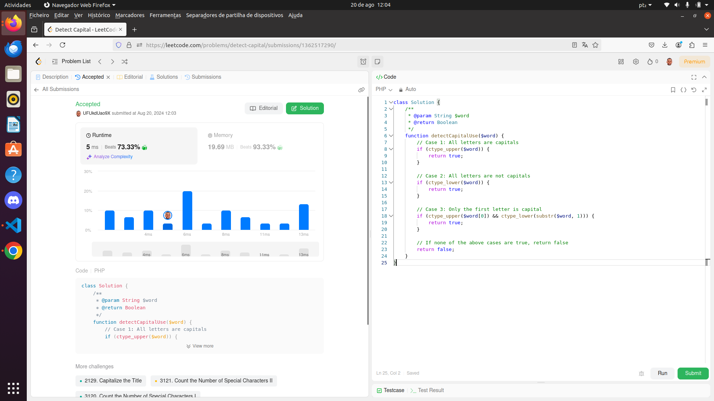

# easycomtec

<h1 align="center">Hello 👋, I'm Ramon Mendes - Software Developer</h1>
<h3 align="center">A back-end developer passionate about technology</h3>

- 🔭 I am currently working on [Back-end project development](https://github.com/RamonSouzaDev/To-Do-List-)

- 🌱 I'm currently learning **Software Architecture and Engineering**

- 📫 How to reach me **dwmom@hotmail.com**

   I ended up getting excited and developing, even after the delivery date.
  
<h3 align="left"> Let's network :</h3>

<h3 align="left">Languages and Tools</h3>

 
   </a>    

<a href="https://www.docker.com/" target="_blank" rel="noreferrer">  

 
<h1 align="center">Welcome to EASYCOMTEC </h1>

## EASYCOMTEC

